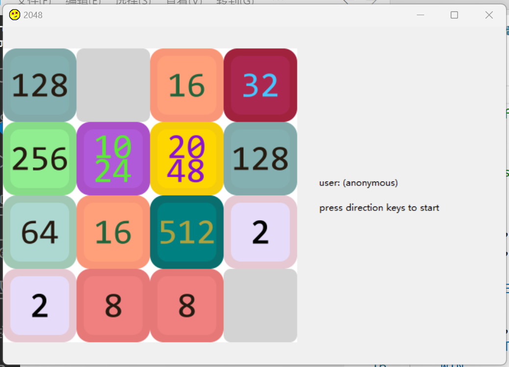
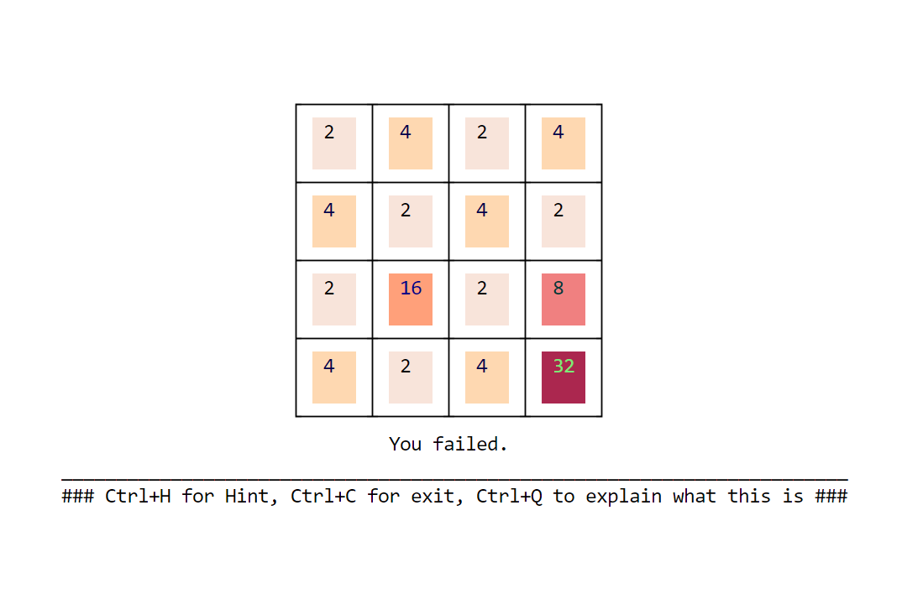
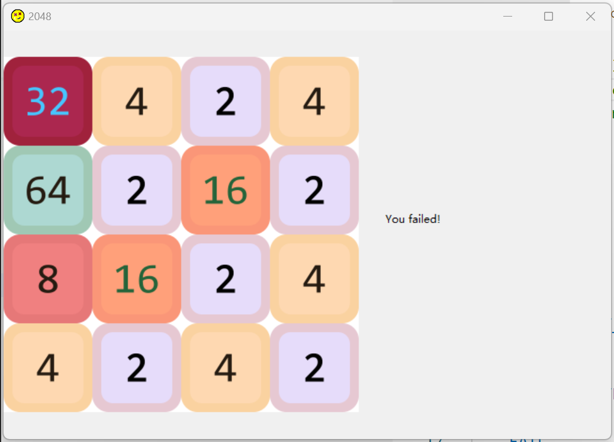

> game 2024 CUI+GUI(wxpython)+hint
# functions
- [x] 2048 game logic
- [x] timing
- [x] user management
- [x] hint(monte-carlo search, depth=4, target=sum+nb_zeros)
- [x] CUI
- [x] GUI(basic)
- [ ] GUI(menubar: help, config)
- [ ] GUI(bind key event only on frame, currently use pynput listen any key press)
- [ ] AI(learn 4-step goodness increment)
- [ ] hint(search prunning and so on)
- [ ] organised files
# set up
- packages
    
    ``pip install -r requirements.txt``
    
    *(do wxpython really supported for python 3.10+ ?)*

- run
  
  ``python . ARGUMENTS``

  ```
  options:
  -h, --help            show this help message and exit
  -c USER, --user USER
  -p PASSWD, --passwd PASSWD
  -g, --gui
  ```

# nomen
- tiles: tiles with values 0,1,...,11, display values _,2,4,...,2048
- m: tile matrix

# reference
- [ChessProgramming wiki](https://www.chessprogramming.org/Monte-Carlo_Tree_Search)
- [impl_1](https://github.com/yangshun/2048-python)
- [impl_2](https://github.com/plibither8/2048.cpp)

# debug

- logging tiles samples for training: set TRACK=True in config.py
- lower win condition: set LVWIN less than 11

# demo


